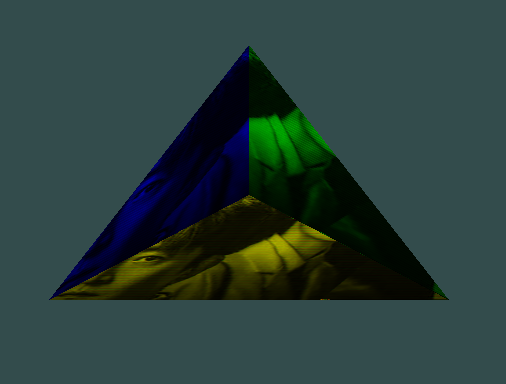

# 实验报告一

---

姓名：韩东时  
学号：202311998063

---

## 环境配置

### 系统环境

- 操作系统：Windows 11
- 架构：x86_64
- 编译器：MSVC（使用 CMake 生成 VS 编译工程）
- 开发环境：Visual Studio Code + CMake Tools 插件

---

### 项目环境搭建（VSCode + CMake + vcpkg）

本项目采用 VSCode + CMake + vcpkg 搭建 C++ OpenGL 渲染环境，具有良好的跨平台性与自动依赖管理能力。

#### 使用的依赖库

通过 [vcpkg](https://github.com/microsoft/vcpkg) 安装以下依赖：

- `glfw3`：窗口和上下文管理
- `freetype`：字体渲染
- `libpng`、`zlib`：PNG 图像加载支持（隐式依赖）
- `OpenGL`：Windows 自带，不需要额外安装

安装命令示例：

```powershell
vcpkg install glfw3 freetype
```

#### GLAD 配置

使用 [glad](https://glad.dav1d.de/) 在线生成器，选择 OpenGL 版本后下载生成的源文件：

- 将 `glad.h` 放入 `include/glad/`
- 将 `glad.c` 放入 `src/`

---

### 项目结构

```plaintext
项目根目录
├─ include/          # 头文件（如 glad, stb_image, freetype 等）
├─ src/              # 源代码（main.cpp, ShaderLoader.cpp 等）
├─ shaders/          # 着色器代码（.vs, .fs）
├─ static/images/    # 纹理资源
├─ fonts/            # 字体文件（如 Arial.ttf）
├─ CMakeLists.txt    # 构建配置
```

---

### CMake 配置说明

本项目使用 `CMakeLists.txt` 配置构建，具备以下特性：

- 自动查找并链接 vcpkg 安装的依赖（通过 `CMAKE_TOOLCHAIN_FILE`）
- 自动复制资源文件夹（如 `shaders/`, `fonts/`, `static/images/`）到可执行文件目录
- 使用 C++17 编译标准

构建命令示例：

```powershell
cmake .. -DCMAKE_TOOLCHAIN_FILE="D:/vcpkg/scripts/buildsystems/vcpkg.cmake"
cmake --build .
```

运行程序：

```powershell
cd ./Debug
./OpenGL_Project.exe
```

---

## 编译 & 运行

在 VSCode 中使用 `CMake Tools` 插件：

- `Ctrl+Shift+P` → `CMake: Configure`
- `CMake: Build`
- `F5` 或 `.\Debug\OpenGL_Project.exe` 运行

确保工作目录为可执行文件路径，确保能够加载资源文件（字体、着色器、纹理）。

---

## 任务实现

### 着色器加载器

定义了一个 `ShaderLoader` 类用于加载、编译和管理着色器文件。

关键方法包括：

- `loadVertexShader` / `loadFragmentShader`
- `createShaderProgram`
- `checkShaderCompilation`
- `checkProgramLinking`

封装了 OpenGL 着色器流程：创建 → 编译 → 链接 → 使用，支持从文件路径直接加载 `.vs` / `.fs` 着色器。

---

### 任务 1：立方体绘制

在三角形渲染基础上绘制一个简单的立方体模型（以四面体近似），包括：

- 顶点数据定义
- 面的三角划分
- 顶点缓冲对象绑定

---

### 任务 2：彩色面渲染

为立方体的每个三角面指定颜色，确保至少一个面内三个顶点的颜色各不相同，展现基本的插值着色效果。

---

### 任务 3：纹理贴图

在彩色面基础上，引入纹理贴图：

- 加载 PNG 图片（通过 `stb_image` + `libpng`）
- 创建 OpenGL 纹理对象并绑定至片元着色器
- 成功将图片贴图应用至立方体表面

示例效果截图如下：



---
